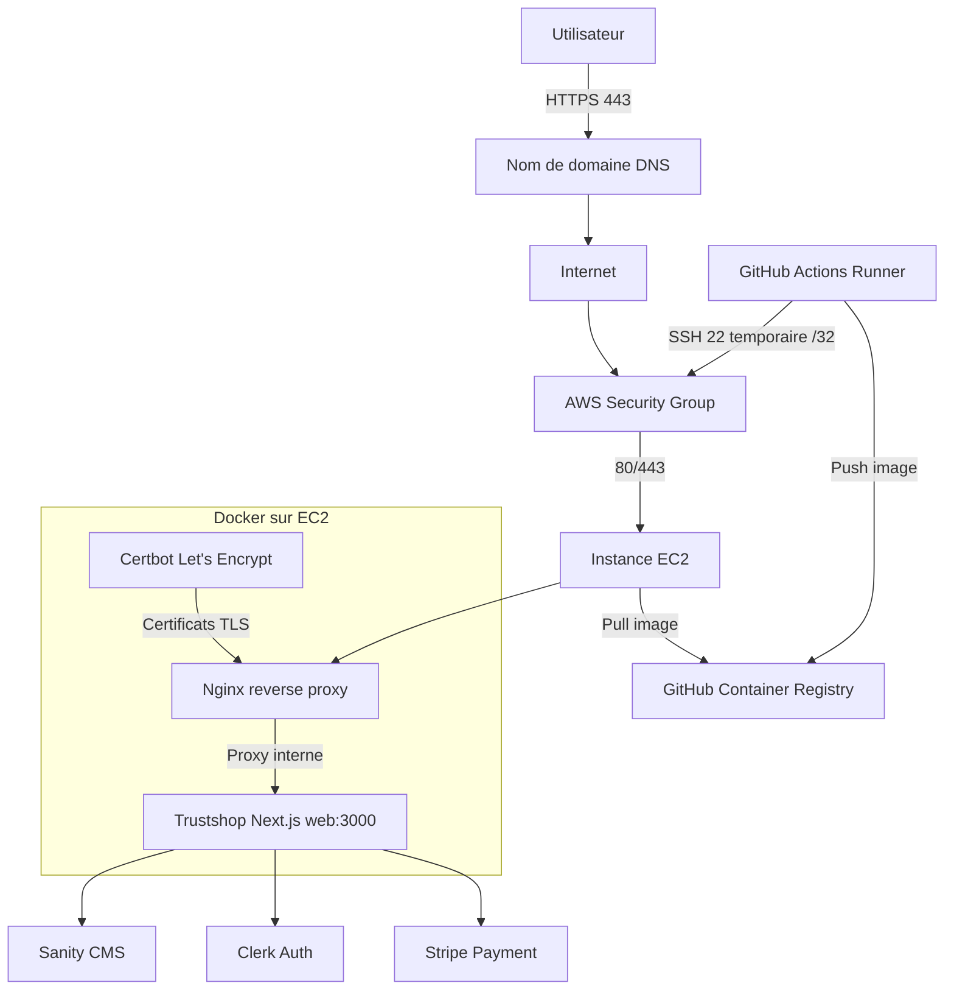

# Corrections A Integrer Dans Le Memoire

Ce document regroupe les corrections a appliquer au memoire et les textes techniques
prets a adapter dans le document final.

## 1. Mise En Forme Selon La Methodologie MP/RAP/MFC

Appliquer les regles suivantes sur tout le document:

- Police du corps de texte: Arial, taille 14.
- Titres principaux: Arial, taille 16.
- Interligne: 1,5.
- Alignement: texte justifie.
- Notes de bas de page: Arial, taille 10.
- Bibliographie: style APA 7e edition.
- Tableaux, figures et schemas: numerotation, titre et source.
- Annexes: liste des annexes avant les annexes, puis une page de garde par annexe.

Corrections de forme visibles a traiter:

- `DockerFile` devient `Dockerfile`.
- `Github` devient `GitHub`.
- `Next js` devient `Next.js`.
- `SeHcrets` devient `Secrets`.
- Ajouter un espace apres les deux-points.
- Harmoniser les titres: `Chapitre`, `Section`, `Figure`, `Tableau`, `Annexe`.
- Verifier que la table des matieres correspond aux titres finaux.

## 2. Nouvelle Architecture Reseau A Presenter

La solution finale ne repose plus seulement sur une adresse IP publique en HTTP. Elle
integre un nom de domaine, un certificat TLS Let's Encrypt et un durcissement de l'acces
SSH utilise par GitHub Actions.



Texte a inserer dans la section architecture:

> L'architecture finale repose sur une instance AWS EC2 executant Docker Compose. Le
> service Nginx joue le role de reverse proxy public et expose uniquement les ports 80
> et 443. Le port 80 est utilise pour la redirection HTTP vers HTTPS et pour le challenge
> Let's Encrypt, tandis que le port 443 permet l'acces securise a l'application via TLS.
> Le conteneur applicatif Next.js ecoute sur le port 3000 uniquement dans le reseau
> Docker interne; ce port n'est pas expose directement a Internet. Le pipeline GitHub
> Actions publie l'image Docker dans GitHub Container Registry, puis se connecte a EC2
> via SSH pour declencher le deploiement avec Docker Compose.

## 3. Domaine Et HTTPS Avec Certbot

Texte a inserer dans la partie implementation:

> Afin d'ameliorer la securite et le caractere professionnel du deploiement, un nom de
> domaine a ete associe a l'adresse publique de l'instance EC2. Un enregistrement DNS
> de type A pointe vers l'Elastic IP du serveur. Cette configuration evite aux utilisateurs
> d'acceder directement a l'application par une adresse IP et facilite la mise en place
> du protocole HTTPS.
>
> La securisation HTTPS est assuree par Let's Encrypt et Certbot. Certbot genere un
> certificat TLS valide pour le domaine, puis Nginx utilise ce certificat pour chiffrer les
> communications entre le navigateur de l'utilisateur et le serveur. Le trafic HTTP est
> automatiquement redirige vers HTTPS. Cette configuration protege les echanges,
> notamment les donnees d'authentification et les interactions avec les services externes
> comme Clerk, Sanity et Stripe.

Commandes de validation a capturer pour les annexes:

```bash
curl -I "https://$TRUSTSHOP_DOMAIN"
docker compose -f docker-compose.prod.yml ps
docker compose -f docker-compose.prod.yml --profile certbot run --rm certbot renew --dry-run
```

## 4. Suppression De L'Ouverture SSH `0.0.0.0/0`

Texte a inserer dans la section securite reseau:

> L'acces SSH a l'instance EC2 ne doit pas etre ouvert a l'ensemble d'Internet avec la
> regle `0.0.0.0/0`. Pour le deploiement automatise, le workflow GitHub Actions recupere
> l'adresse IP publique temporaire du runner, autorise uniquement cette adresse en
> `/32` sur le port 22, execute le deploiement, puis supprime la regle a la fin du job.
> Cette approche reduit la surface d'attaque tout en conservant l'automatisation du
> pipeline CI/CD.

Precision importante:

> La variable `HOSTNAME=0.0.0.0` presente dans le Dockerfile n'a pas le meme sens que
> l'ouverture SSH a `0.0.0.0/0` dans AWS. Dans le conteneur, elle permet simplement au
> serveur Node.js/Next.js d'ecouter sur toutes les interfaces internes du conteneur. Le
> risque principal concerne les regles du groupe de securite AWS lorsqu'elles exposent
> SSH publiquement.

## 5. Analyse De Securite

Texte a inserer comme nouvelle section:

> L'analyse de securite de la solution porte sur les principaux points d'exposition du
> systeme: l'acces public a l'application, l'acces SSH au serveur, la gestion des secrets,
> la chaine de construction Docker, le registre d'images et la disponibilite du service.
>
> Les flux publics sont limites aux ports 80 et 443. Le port 80 sert principalement a la
> redirection vers HTTPS et au renouvellement des certificats Let's Encrypt. Le port 443
> est utilise pour les communications chiffrees entre les utilisateurs et Nginx. Le port
> applicatif 3000 reste interne au reseau Docker, ce qui evite une exposition directe du
> serveur Next.js.
>
> Les secrets necessaires au pipeline, comme la cle SSH, les variables Clerk, Sanity et
> les informations AWS, sont stockes dans GitHub Secrets. Ils ne sont pas inscrits dans le
> code source. Le pipeline utilise egalement un mecanisme de rollback afin de revenir a
> la derniere image stable si le healthcheck post-deploiement echoue.
>
> La principale amelioration de securite concerne l'acces SSH. Au lieu d'autoriser le port
> 22 depuis n'importe quelle adresse, le workflow GitHub Actions ajoute temporairement
> l'IP du runner dans le groupe de securite AWS, puis la retire apres le deploiement. Cela
> limite fortement les tentatives d'acces non autorise.

## 6. Tableau Des Risques Et Contre-Mesures

| Risque | Impact possible | Contre-mesure appliquee ou recommandee |
| --- | --- | --- |
| SSH ouvert a `0.0.0.0/0` | Tentatives de connexion non autorisees, brute force | Autoriser temporairement l'IP du runner GitHub Actions en `/32`, puis supprimer la regle |
| Absence de HTTPS | Donnees echangees en clair, image non professionnelle | Domaine + certificat Let's Encrypt + redirection HTTP vers HTTPS |
| Fuite de secrets | Compromission du serveur ou des services externes | GitHub Secrets, aucun secret dans le depot, rotation des cles si necessaire |
| Port applicatif expose | Acces direct au serveur Next.js sans reverse proxy | Garder `3000` en `expose` Docker uniquement, publier seulement Nginx |
| Image Docker vulnerable | Exploitation d'une dependance ou d'une image obsolete | Mettre a jour les images, ajouter un scan de securite dans une evolution DevSecOps |
| Echec de deploiement | Indisponibilite de l'application | Healthcheck post-deploiement et rollback vers la derniere image stable |
| Instance EC2 unique | Point unique de defaillance | Perspective: Load Balancer, plusieurs instances, autoscaling |
| Absence de monitoring avance | Detection tardive des incidents | Perspective: CloudWatch ou Grafana avec alertes |
| Mauvaise gestion des couts AWS | Facturation inutile | Instance adaptee, surveillance des ressources, suppression des images inutiles |

## 7. Annexes A Ajouter

### Annexe A : Dockerfile

Contenu attendu:

- Extrait du `Dockerfile`.
- Explication du multi-stage build.
- Mention du port interne `3000`.
- Precision sur `HOSTNAME=0.0.0.0` dans le conteneur.

### Annexe B : Workflow GitHub Actions

Contenu attendu:

- Extrait de `.github/workflows/deploy.yml`.
- Capture d'un workflow reussi.
- Capture de l'ouverture temporaire SSH `/32` si visible dans les logs.
- Explication du build, push GHCR, deploiement SSH, healthcheck et rollback.

### Annexe C : Docker Compose Production

Contenu attendu:

- Extrait de `deploy/docker-compose.prod.yml`.
- Mise en evidence de `web`, `nginx`, `certbot`.
- Ports publics `80` et `443`.
- Port `3000` interne uniquement.

### Annexe D : Configuration Nginx HTTPS

Contenu attendu:

- Extrait de `nginx/templates/default.conf.tmpl`.
- Preciser qu'il s'agit du template Nginx utilise pour injecter le domaine avec
  `TRUSTSHOP_DOMAIN`.
- Redirection HTTP vers HTTPS.
- Certificats Let's Encrypt.
- Proxy vers `web:3000`.

### Annexe E : Certificat Et Domaine

Contenu attendu:

- Capture DNS du domaine.
- Capture du certificat HTTPS dans le navigateur.
- Resultat de `curl -I https://domaine`.
- Resultat de `certbot renew --dry-run`.

### Annexe F : Groupe De Securite AWS

Contenu attendu:

- Capture des regles entrantes.
- Ports `80` et `443` ouverts.
- Port `22` limite a une IP de confiance ou ajoute temporairement par GitHub Actions.
- Absence de SSH ouvert a `0.0.0.0/0`.

### Annexe G : Commandes EC2

Contenu attendu:

```bash
docker --version
docker compose version
cd /opt/trustshop/deploy
docker compose -f docker-compose.prod.yml ps
docker compose -f docker-compose.prod.yml logs nginx --tail=50
curl -I "https://$TRUSTSHOP_DOMAIN"
```

## 8. Monitoring A Presenter

Si CloudWatch ou Grafana n'est pas installe avant la soutenance, le presenter comme une
amelioration prioritaire et expliquer la supervision minimale deja disponible:

> Dans la version actuelle, la supervision repose sur les healthchecks Docker, les logs
> GitHub Actions, les logs Docker Compose et les journaux Nginx. Ces elements permettent
> de verifier l'etat du deploiement et de diagnostiquer les erreurs principales. Une
> evolution naturelle consiste a ajouter AWS CloudWatch pour suivre les metriques EC2
> comme le CPU, la memoire, le disque et le trafic reseau, ou Grafana pour disposer de
> tableaux de bord plus visuels.

## 9. Conclusion A Mettre A Jour

Texte a integrer dans la conclusion:

> La solution finale ne se limite pas a l'automatisation du deploiement. Elle integre
> egalement des elements essentiels de securite et d'exploitation: nom de domaine,
> HTTPS avec certificat Let's Encrypt, reverse proxy Nginx, limitation des ports exposes,
> gestion securisee des secrets, ouverture SSH temporaire pour GitHub Actions,
> healthcheck et rollback automatique. Ces ameliorations rapprochent le projet d'une
> architecture de production tout en restant adaptees au cadre academique et aux couts
> maitrises d'une instance EC2 unique.

## 10. Checklist De Validation Avant Soutenance

- Le domaine pointe vers l'Elastic IP de l'instance EC2.
- `https://domaine` repond correctement dans le navigateur.
- `curl -I https://domaine` retourne un statut HTTP valide.
- `certbot renew --dry-run` reussit.
- Les ports publics sont limites a `80` et `443`.
- Le port `22` n'est pas ouvert a `0.0.0.0/0`.
- Le port `3000` n'est pas expose publiquement.
- GitHub Actions deploie l'image Docker avec succes.
- Le rollback est explique et, si possible, teste.
- Les captures sont ajoutees aux annexes.
- La table des matieres et les listes des figures/tableaux/annexes sont regenerees.
